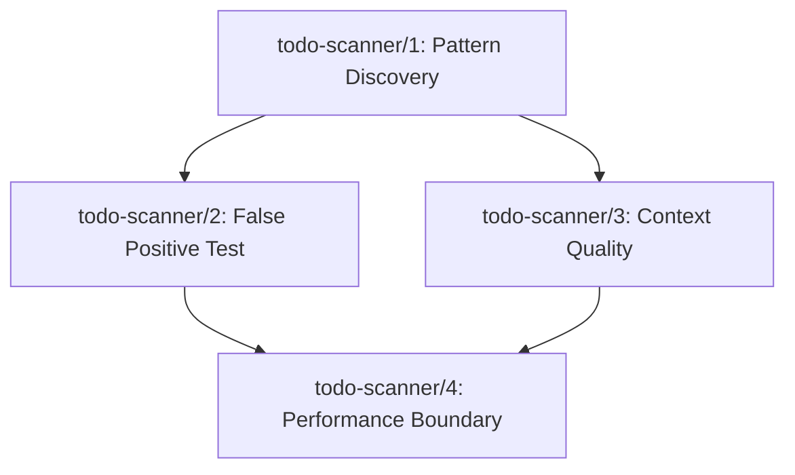

## Step 1 — Restate the Goal as a Falsifiable Outcome

> **Goal:** Implement automated TODO scanning functionality that identifies actionable technical debt patterns across the codebase
> **Success metric:** Scanner correctly identifies and categorizes 95%+ of TODO patterns with <5% false positive rate
> **Time horizon:** 2 weeks
> **Null hypothesis:** TODO pattern detection is too unreliable or noisy to provide actionable technical debt insights

## Step 2 — Surface Hidden Assumptions

1. `[UNKNOWN]` — TODO comments follow consistent enough patterns to be reliably parsed
2. `[UNKNOWN]` — Developers actually use #TODO: [Description] format versus other variants (TODO:, @todo, FIXME, etc.)
3. `[RISKY]` — TODO scanning will produce actionable insights rather than overwhelming noise
4. `[UNKNOWN]` — File type filtering is necessary to avoid false positives in documentation/config files
5. `[KNOWN]` — Python regex can handle the basic pattern matching required
6. `[UNKNOWN]` — TODO descriptions contain enough context to be meaningful for prioritization

## Step 3 — Design the Experiments

```
Experiment ID: todo-scanner/1
Experiment title: TODO Pattern Discovery
Hypothesis: If we scan the existing codebase for all TODO variants, then we will find that >70% follow the #TODO: [Description] pattern, because this is the documented standard.
Assumption tested: TODO comments follow consistent enough patterns to be reliably parsed
Experiment type: unit proof
Success criteria:
  Primary: Discover actual TODO pattern distribution across codebase
  Secondary: Identify top 5 most common TODO formats
  Anti-goals: Must not modify any existing code
Falsification criteria: <30% of TODOs follow any single consistent pattern
Minimum viable implementation:
  - Create regex inventory script for all TODO variants (TODO, FIXME, HACK, XXX, @todo)
  - Run against current codebase and generate frequency report
  - Categorize by file type and pattern variant
Dependencies: none
Estimated signal time: 1 day
Owner archetype: backend
```

```
Experiment ID: todo-scanner/2
Experiment title: False Positive Boundary Test
Hypothesis: If we apply basic file type filtering (.py, .js, .ts, .go), then false positive rate will drop below 5%, because TODOs in code files are more structured than in docs.
Assumption tested: File type filtering is necessary to avoid false positives in documentation/config files
Experiment type: unit proof
Success criteria:
  Primary: <5% false positive rate on filtered vs unfiltered results
  Secondary: Maintain >90% recall of legitimate TODOs
  Anti-goals: Must not exclude legitimate TODOs in code files
Falsification criteria: False positive rate >15% even with filtering
Minimum viable implementation:
  - Implement file extension whitelist filtering
  - Run on sample directories (docs/, src/, tests/)
  - Manually validate 100 random results for precision/recall
Dependencies: todo-scanner/1
Estimated signal time: 1 day
Owner archetype: backend
```

```
Experiment ID: todo-scanner/3
Experiment title: Context Extraction Quality
Hypothesis: If we extract the description text after TODO patterns, then >80% will contain actionable context (not just "fix this"), because developers write meaningful TODO descriptions.
Assumption tested: TODO descriptions contain enough context to be meaningful for prioritization
Experiment type: unit proof
Success criteria:
  Primary: >80% of descriptions contain >5 meaningful words
  Secondary: <20% are generic phrases like "fix this", "broken", "temp"
  Anti-goals: Must not require natural language processing
Falsification criteria: >50% of descriptions are generic/actionless
Minimum viable implementation:
  - Extract description text from discovered TODO patterns
  - Apply simple heuristics (word count, generic phrase detection)
  - Sample 100 descriptions for manual quality assessment
Dependencies: todo-scanner/1
Estimated signal time: 1 day
Owner archetype: backend
```

```
Experiment ID: todo-scanner/4
Experiment title: Scanner Performance Boundary
Hypothesis: If we scan the entire repository with optimized regex patterns, then scan time will be <10 seconds for repos under 100MB, because file I/O is the bottleneck, not pattern matching.
Assumption tested: TODO scanning will produce actionable insights rather than overwhelming noise
Experiment type: load test
Success criteria:
  Primary: Full repository scan completes in <10 seconds
  Secondary: Memory usage stays under 100MB during scan
  Anti-goals: Scanner must not impact developer workflow
Falsification criteria: Scan time >30 seconds or memory usage >500MB
Minimum viable implementation:
  - Implement file-by-file scanning with compiled regex
  - Test against current repository size
  - Measure time and memory with different file traversal strategies
Dependencies: todo-scanner/2
Estimated signal time: 1 day
Owner archetype: backend
```

## Step 4 — Sequence the Experiments



## Step 5 — Define the Engineering Contract

**Minimum experiments that must pass:** todo-scanner/1, todo-scanner/2, and todo-scanner/3

**Data artifact each experiment must produce:**
- Experiment 1: Pattern frequency report with examples
- Experiment 2: Precision/recall metrics with sample validation
- Experiment 3: Context quality assessment with actionability scores
- Experiment 4: Performance benchmarks with memory/time profiles

**Kill condition:** If fewer than 50% of discovered TODOs contain actionable context (experiment 3 fails), or if false positive rate exceeds 15% (experiment 2 fails), abandon this approach and consider manual TODO audit instead.