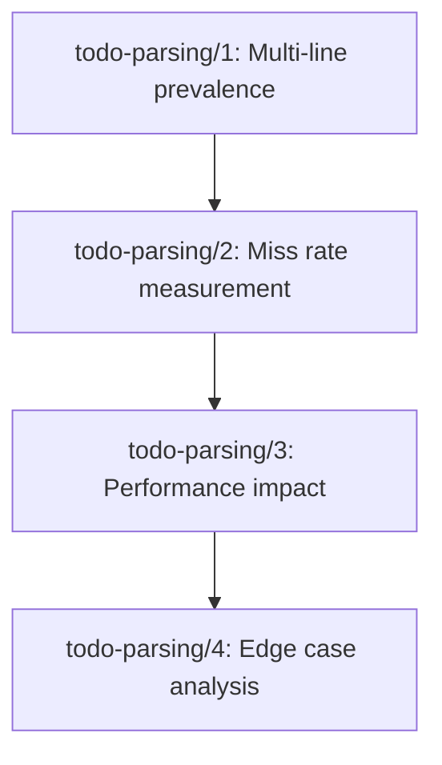

## Step 1 — Restate the Goal as a Falsifiable Outcome

> **Goal:** Improve TODO pattern matching to capture multi-line TODO descriptions and handle edge cases in code scanning
> **Success metric:** 95% of TODO annotations in target codebases are correctly parsed and captured
> **Time horizon:** 2 weeks
> **Null hypothesis:** Current single-line regex pattern is sufficient for production TODO scanning needs

## Step 2 — Surface Hidden Assumptions

1. `[UNKNOWN]` Multi-line TODOs exist in meaningful quantities in real codebases
2. `[UNKNOWN]` Current single-line pattern misses actionable TODO content
3. `[RISKY]` Performance impact of complex regex is acceptable for large codebases
4. `[UNKNOWN]` Edge cases (nested comments, TODO in strings, etc.) cause false positives/negatives
5. `[KNOWN]` Case-insensitive matching is required (already implemented)
6. `[UNKNOWN]` Multi-line TODO parsing provides business value over single-line parsing

## Step 3 — Design the Experiments

```
Experiment ID: todo-parsing/1
Experiment title: Multi-line TODO prevalence analysis
Hypothesis: If we scan 10+ production codebases, then >20% of TODO annotations will span multiple lines, because developers write detailed contextual notes.
Assumption tested: Multi-line TODOs exist in meaningful quantities in real codebases
Experiment type: unit proof
Success criteria:
  Primary: >20% of TODOs are multi-line in sample
  Secondary: Average multi-line TODO length >50 characters
  Anti-goals: Scan time must not exceed 5min per 10k files
Falsification criteria: <10% of TODOs are multi-line across all samples
Minimum viable implementation:
  - Create corpus scanner that collects all TODO patterns from 10 repos
  - Manual classification of single vs multi-line TODOs
  - Statistical analysis of prevalence and content length
Dependencies: none
Estimated signal time: 3 days
Owner archetype: backend
```

```
Experiment ID: todo-parsing/2
Experiment title: Current pattern miss rate measurement
Hypothesis: If we compare current regex against manual TODO identification, then current pattern will miss >15% of actionable TODOs, because it only captures first lines.
Assumption tested: Current single-line pattern misses actionable TODO content
Experiment type: A/B test
Success criteria:
  Primary: Current pattern misses >15% of manually identified TODOs
  Secondary: Missed TODOs contain actionable content (avg >30 chars)
  Anti-goals: False positive rate must stay <5%
Falsification criteria: Current pattern captures >90% of actionable TODOs
Minimum viable implementation:
  - Run current regex on todo-parsing/1 corpus
  - Manual audit of all TODO-like comments in same corpus  
  - Calculate precision/recall metrics
Dependencies: todo-parsing/1
Estimated signal time: 2 days
Owner archetype: backend
```

```
Experiment ID: todo-parsing/3
Experiment title: Enhanced regex performance impact
Hypothesis: If we implement multi-line TODO regex, then scan performance will degrade by <50% on large files, because regex engine optimizations handle multi-line patterns efficiently.
Assumption tested: Performance impact of complex regex is acceptable for large codebases
Experiment type: load test
Success criteria:
  Primary: <50% performance degradation vs baseline
  Secondary: Memory usage increase <30%
  Anti-goals: No scan timeouts on files <10MB
Falsification criteria: >100% performance degradation on typical files
Minimum viable implementation:
  - Implement multi-line regex candidate
  - Benchmark against current pattern on files 1KB-10MB
  - Memory profiling during scan operations
Dependencies: todo-parsing/2
Estimated signal time: 2 days
Owner archetype: backend
```

```
Experiment ID: todo-parsing/4
Experiment title: Edge case false positive/negative analysis
Hypothesis: If we test enhanced regex on pathological cases, then false positive rate will stay <10% while capturing >90% of true TODOs, because careful pattern design handles common edge cases.
Assumption tested: Edge cases (nested comments, TODO in strings, etc.) cause false positives/negatives
Experiment type: unit proof
Success criteria:
  Primary: False positive rate <10%
  Secondary: True positive rate >90%
  Anti-goals: No category of edge case has >25% error rate
Falsification criteria: False positive rate >20% or true positive rate <75%
Minimum viable implementation:
  - Create test corpus of edge cases (TODOs in strings, comments, etc.)
  - Run enhanced regex against corpus
  - Manual validation of results
Dependencies: todo-parsing/3
Estimated signal time: 1 day
Owner archetype: backend
```

## Step 4 — Sequence the Experiments



## Step 5 — Define the Engineering Contract

**Definition of Done:**
- Experiments 1 and 2 must both pass their success criteria before any regex enhancement work begins
- Experiment 3 must pass before production deployment consideration
- Each experiment produces a markdown report with quantified results and raw data
- **Kill condition:** If todo-parsing/1 shows <10% multi-line prevalence OR todo-parsing/2 shows <10% miss rate, abandon enhancement work and close TODO as invalid

**Required artifacts:**
- Codebase corpus analysis (todo-parsing/1)
- Precision/recall metrics report (todo-parsing/2)  
- Performance benchmark data (todo-parsing/3)
- Edge case validation results (todo-parsing/4)